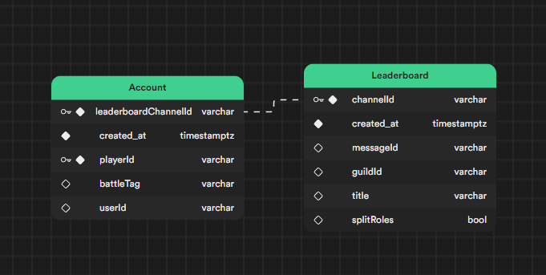

# How To

Download this repository. Install node (**this is tested with 18.15.0**). Then use on a terminal, in the bot folder:

Create a new project in supabase and add the  following tables:



**Uncheck "Enable Row Level Security (RLS)" on each table if sing in is not necessary in your implementation

```sh
npm install

```

- Edit the `.env.sample` file.

- Run

```sh
node deploy-commands guild

```

Or, if you are going to add the bot to more than one server,

```sh
node deploy-commands global

```

- Rename `.env.sample` to `.env`.

Then, for starting the bot use:

```sh
npm run start

```

And the bot is running.
